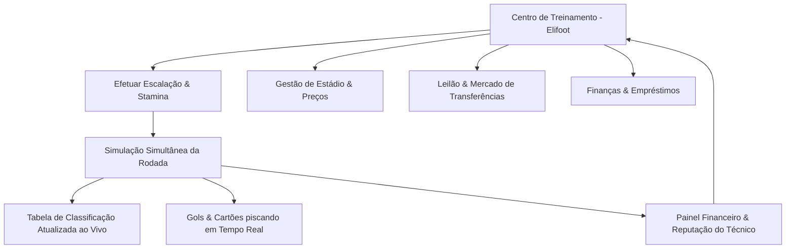

# Plano de Ação: Simulador de Carreira Estilo Elifoot (champions-7-0 v3.0)

Este documento apresenta o plano de ação técnico e visual para a criação de um módulo de gerenciamento de carreira de clubes no **champions-7-0**, modelado sob as mecânicas viciantes do clássico **Elifoot 98**, adaptado para a atualidade e integrado ao banco de dados e APIs do Supabase do projeto.

---

## 1. Visão Geral do Módulo "Elifoot Moderno"

O objetivo é reproduzir a jogabilidade clássica do Elifoot 98: a simplicidade ágil de gerenciar um elenco pequeno, disputar rodadas com simulação simultânea de jogos, controlar finanças rigorosas (com risco de falência), expandir o estádio e participar de leilões dinâmicos de jogadores contra a CPU.

---

## 2. Puxando Dados Atuais via Supabase & API-Football

Usaremos a estrutura atual de tabelas do Supabase (`teams`, `players` e a Edge Function `sync_api_football`) para carregar o banco de dados dinamicamente:

*   **Identidade dos Times (Nomes & Logos):**
    *   O endpoint `loadTeamsFromCloud(division)` lerá os clubes das Série A, B, C e D em tempo real.
    *   A propriedade `badge_url` será renderizada na interface do jogo para exibir o logotipo oficial de cada equipe (puxado do CDN da API-Football).
    *   A propriedade `stadium_name` definirá o nome inicial do estádio do clube (ex: Allianz Parque, Maracanã).
*   **Banco de Jogadores:**
    *   O endpoint `loadTeamRosterFromCloud(teamId)` carregará a lista de atletas de cada equipe.
    *   Reduziremos a complexidade de posições do futebol moderno para as 4 posições canônicas do Elifoot: **G** (Goleiro), **D** (Defensor), **M** (Meio-Campo) e **A** (Atacante).
    *   A força de cada jogador será mapeada do `overall_rating` (OVR de 1 a 99). Jogadores com OVR superior a 80 ganharão a estrela clássica (`*` ou `⭐`) no nome, marcando-os como super-craques.

---

## 3. Fases do Plano de Ação e Cronograma de Desenvolvimento

Como estabelecido nas regras de governança, dividimos o projeto em 5 Fases de microentrega incrementais:

### Fase 1: Setup Físico e Interface "Dark Premium Elifoot"
*   **O quê:** Criar os arquivos isolados `js/career/elifoot-core.js` e `css/elifoot-theme.css`. Adicionar os scripts ao `index.html`.
*   **Estrutura de UI:** Montar o CT do Elifoot com visual limpo e minimalista (fundo preto puro, fontes sans-serif condensadas esportivas, caixas de conteúdo cinza-grafite com acentos em ouro e verde-neon).
*   **Painel Principal:** Exibir no topo o nome do clube do jogador, divisão atual, saldo em caixa, próximo adversário e a barra de rodadas do campeonato (1 a 18 rodadas no formato de 10 times).
*   **Ganhos & ROI:** O usuário tem a percepção instantânea de um produto moderno e refinado, redefinindo o Elifoot clássico em uma interface limpa.

### Fase 2: Escalação do Elenco e Barra de Stamina
*   **O quê:** Desenvolver a tela de escalação. O usuário visualiza o elenco de até 24 jogadores divididos por setores (G, D, M, A).
*   **Mecânicas:**
    *   **Escalação Simplificada:** Clicar nos jogadores titulares para preencher a tática (ex: 4-4-2, 4-3-3, 3-5-2). O sistema calcula a força média dos setores do time.
    *   **Energia (Stamina):** Cada partida consome uma porcentagem de energia. Jogadores com energia abaixo de 60% sofrem redução na força de atuação e correm o risco de lesão (exibida em vermelho com ícone de cruz 🏥).
    *   **Substituições Dinâmicas:** Botões rápidos de troca no banco de reservas.
*   **Ganhos & ROI:** Adiciona a gestão de elenco tática e de recursos físicos, exigindo planejamento para manter os principais atletas inteiros durante a temporada.

### Fase 3: Simulador de Rodada Simultânea (Live Match Screen)
*   **O quê:** Criar a tela de simulação simultânea.
*   **Mecânicas de Simulação:**
    *   Exibir todos os 5 jogos da rodada da divisão rodando lado a lado.
    *   Um cronômetro em tempo real (0' a 90') corre acelerado na parte superior da tela.
    *   A cada minuto de simulação, o motor calcula a probabilidade de gols com base nas forças do ataque de uma equipe contra a defesa do oponente.
    *   **Eventos em Tempo Real:** Quando sai um gol, o placar pisca em verde-neon e exibe o nome do autor do gol.
    *   **Tabela ao Vivo (Live Standing):** Na lateral da tela, a tabela da divisão atualiza os pontos, saldo e gols ao vivo conforme os placares mudam.
    *   **Substituições ao Vivo:** O usuário pode clicar em "Pausar Partida" a qualquer minuto para fazer trocas por fadiga ou lesão.
*   **Ganhos & ROI:** Reproduz o clímax emocional característico do Elifoot. O usuário acompanha as rodadas com alta tensão, torcendo por gols de outras equipes para garantir a liderança ou evitar o rebaixamento.

### Fase 4: Leilão de Jogadores & Finanças do Clube
*   **O quê:** Criar a mecânica de leilões e o balanço financeiro do clube.
*   **Mecânica de Leilão:**
    *   No final da rodada, o sistema lista jogadores no mercado para leilão com um lance inicial baseado em seu OVR e idade.
    *   O usuário pode dar lances em tempo real. A CPU (outros clubes) dará contra-lances automáticos a cada 1-2 segundos. O usuário que der o lance mais alto antes do cronômetro de 10 segundos expirar leva o atleta.
    *   O usuário também pode colocar seus próprios jogadores em leilão para receber propostas financeiras de times rivais controlados pela CPU.
*   **Gestão Financeira:**
    *   **Receita de Ingressos:** Depende do tamanho do estádio e do preço cobrado pelo ingresso (se cobrar muito caro, o estádio esvazia; se for barato, lota, mas rende menos).
    *   **Despesas Semanais:** Salários acumulados dos jogadores (calculados de acordo com sua força) e juros de eventuais empréstimos bancários contraídos.
    *   **Expansão de Estádio:** Investir moedas para aumentar a capacidade das gerais, arquibancadas ou cadeiras numeradas.
*   **Ganhos & ROI:** Cria o desafio de gestão financeira a longo prazo. O usuário precisa equilibrar o desejo de ter super-craques com a capacidade de manter o clube solvente.

### Fase 5: Reputação do Técnico, Convites e Demissões
*   **O quê:** Gerenciar o prestígio profissional do jogador.
*   **Mecânicas:**
    *   **Reputação:** Sobe com vitórias, títulos e promoções; cai com derrotas e rebaixamentos.
    *   **Convites:** No fim de cada temporada, equipes de divisões superiores (ou rivais da mesma divisão) podem enviar convites de contrato caso a reputação do técnico seja compatível com o OVR do clube.
    *   **Demissões:** Caso o time permaneça na zona de rebaixamento por muitas rodadas ou atinja saldo de caixa negativo por 3 rodadas consecutivas, o conselho demite o treinador. O usuário precisa aceitar uma oferta em um time de 4ª divisão com orçamento baixo para recomeçar.
*   **Ganhos & ROI:** O loop completo da jornada profissional. O usuário busca subir de técnico desconhecido da 4ª divisão a campeão mundial nos maiores clubes do Brasil.

---

## 4. Onde a Lógica Existente Continua Protegida (Draft Shield)

*   Todas as novas mecânicas de leilão, stamina e rodadas simultâneas rodarão no objeto global isolado `elifootState` e nos novos arquivos `elifoot-*.js`.
*   A simulação clássica de Copa do Draft em `app.js` continuará referenciando exclusivamente o objeto `state` original, garantindo 0% de impacto no fluxo do Draft já testado e aprovado.

---
*Plano de Ação elaborado em 11 de Julho de 2026.*
*Aprovado para início de planejamento técnico conforme as diretrizes da MaxxSystem.*
