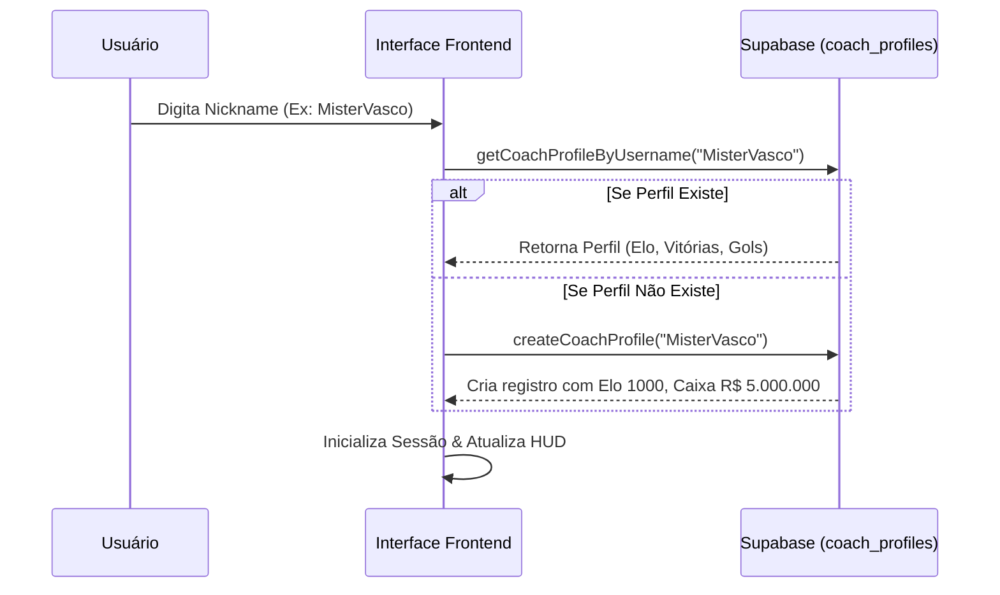

# Roadmap de Criação Tela a Tela: Módulo Elifoot Career (champions-7-0 v3.0)

Este documento especifica o roadmap de criação de telas para o módulo **Elifoot Career Mode**, detalhando cada componente visual, campos de entrada/saída, IDs únicos, comportamento interativo e a integração com o banco de dados Supabase para o **Ranking Online**.

---

## Fluxo de Autenticação e Registro Integrado ao Ranking

A autenticação já existe e é baseada no nickname do jogador (tabela `coach_profiles`). A criação de uma nova campanha de Elifoot se vinculará diretamente a este perfil. Toda vitória, gol marcado ou título conquistado no Elifoot atualizará os campos de estatísticas globais do perfil na nuvem, alimentando o **Ranking Online** em tempo real.

---

## Especificação de Telas e Campos (Roadmap Tela a Tela)

### Tela 1: Lobby Principal & Ranking Online
A tela inicial do jogo após o login. Apresenta as opções de modo de jogo e o ranking mundial.

*   **Campos de Entrada (Inputs):**
    *   `#btn-leaderboard-trophies` (Button): Alterna o ranking para visualização por Elo (Troféus).
    *   `#btn-leaderboard-titles` (Button): Alterna o ranking para visualização por Títulos (Vitórias).
    *   `#btn-leaderboard-goals` (Button): Alterna o ranking para visualização por Gols Marcados.
    *   `#btn-start-elifoot-career` (Button): Inicia o fluxo de nova carreira estilo Elifoot.
*   **Campos de Saída (Outputs/Exibição):**
    *   `#hud-coach-name` (Text): Nome do usuário logado.
    *   `#hud-user-trophies` (Number): Pontos de Elo acumulados.
    *   `#hud-user-titles` (Number): Total de títulos/sprints vencidos.
    *   `#leaderboard-entries-container` (Table Body): Lista de 50 melhores jogadores com as colunas: Posição, Treinador e Pontuação do Ranking.
*   **Integração DB:** Dispara `loadGlobalLeaderboard()` ao entrar e ao alternar abas.

---

### Tela 2: Seleção de Clube (Novo Jogo)
Aparece ao clicar em "Iniciar Carreira Elifoot". Sorteia 3 equipes da Série D (4ª divisão) para o usuário escolher seu clube inicial.

*   **Campos de Entrada (Inputs):**
    *   `#btn-select-club-[teamId]` (Button): Escolhe a equipe correspondente.
    *   `#btn-refresh-selection` (Button): Sorteia 3 novas equipes da Série D (limite de 3 tentativas por campanha).
*   **Campos de Saída (Outputs/Exibição):**
    *   `#club-card-container` (Grid): Lista 3 cards de clubes contendo:
        *   Logo oficial do time (`img.club-badge`)
        *   Nome completo do clube e apelido (`.club-name`)
        *   Nome do estádio e capacidade inicial (`.stadium-info`)
        *   Força geral do time (OVR de 1 a 99)
        *   Orçamento inicial disponível para transferências (Caixa em R$)
*   **Integração DB:** Lê a tabela `teams` com filtro `division = 4` (Série D) e `is_active = true`.

---

### Tela 3: Centro de Treinamento (CT - Painel de Gestão)
O hub central de operações do modo carreira.

*   **Campos de Entrada (Inputs):**
    *   `#nav-tab-squad` (Tab Button): Acessa a escalação do time.
    *   `#nav-tab-market` (Tab Button): Acessa o mercado de leilões.
    *   `#nav-tab-stadium` (Tab Button): Acessa a gestão do estádio e finanças.
    *   `#btn-play-round` (Button): Dispara o simulador da próxima rodada.
*   **Campos de Saída (Outputs/Exibição):**
    *   `#ct-club-badge` (Image): Logo do time atual do usuário.
    *   `#ct-club-name` (Text): Nome do clube.
    *   `#ct-current-division` (Text): Exibe "Série D", "Série C", "Série B" ou "Série A".
    *   `#ct-current-round` (Text): Rodada atual (Ex: "Rodada 1 de 18").
    *   `#ct-cash-balance` (Text): Saldo atual em caixa formatado em R$ (Ex: "R$ 4.500.000").
    *   `#ct-next-match` (Text): Próxima partida e adversário, indicando se é em casa ou fora.

---

### Tela 4: Gestão do Elenco (Escalação Tática)
Aba dentro do CT onde o usuário define os titulares e gerencia a fadiga física dos jogadores.

*   **Campos de Entrada (Inputs):**
    *   `#select-tactical-formation` (Dropdown): Formações táticas (4-4-2, 4-3-3, 3-5-2, etc.).
    *   `#checkbox-select-player-[playerId]` (Checkbox/Toggle): Define se o jogador é Titular, Reserva ou Fica de Fora.
*   **Campos de Saída (Outputs/Exibição):**
    *   `#squad-list-table` (Table): Listagem de jogadores contendo:
        *   Nome e OVR (ex: `Romário 88 ⭐`)
        *   Posição clássica mapeada (`G`, `D`, `M`, `A`)
        *   Barra de Stamina (`.stamina-progress-bar` de 0% a 100%)
        *   Status de lesão ou suspensão (ícones coloridos explicativos)
    *   `#squad-avg-rating` (Text): Média de OVR do time escalado.

---

### Tela 5: Mercado de Transferências & Leilão
Aba de contratação e venda de atletas através de leilões cronometrados.

*   **Campos de Entrada (Inputs):**
    *   `#btn-place-bid-[playerId]` (Button): Dá um lance adicionando 5% ao valor atual.
    *   `#btn-sell-player-[playerId]` (Button): Coloca um jogador do próprio elenco em leilão.
    *   `#btn-accept-proposal-[proposalId]` (Button): Aceita a maior proposta da CPU pelo seu jogador.
*   **Campos de Saída (Outputs/Exibição):**
    *   `#auction-timer` (Countdown): Cronômetro visual regressivo de 10 segundos.
    *   `#auction-current-bid` (Text): Exibe o valor do maior lance atual e quem o deu (Ex: "R$ 1.200.000 por SE Palmeiras").
    *   `#market-players-grid` (Grid): Cards de jogadores disponíveis no mercado com nome, OVR, posição e lance inicial.

---

### Tela 6: Finanças & Estádio
Aba para balanceamento financeiro semanal e ampliação física da infraestrutura do clube.

*   **Campos de Entrada (Inputs):**
    *   `#input-price-general`, `#input-price-stands`, `#input-price-vip` (Number Inputs): Preço cobrado por ingresso em cada setor.
    *   `#btn-upgrade-sector-[sectorId]` (Button): Compra ampliação de capacidade do setor selecionado.
    *   `#btn-take-loan` (Button): Pega empréstimo bancário sob taxa de juros fixa por rodada.
*   **Campos de Saída (Outputs/Exibição):**
    *   `#finance-sheet-summary` (Text Block): Balanço detalhado (Receita de bilheteria anterior, patrocínio semanal, salários de elenco debitados e saldo líquido).
    *   `#stadium-capacity-info` (Text): Ocupação média e capacidade máxima de cada setor.

---

### Tela 7: Simulação Simultânea de Rodada (Live Match Ticker)
Tela aberta ao iniciar a rodada. Permite acompanhar as partidas e intervir se necessário.

*   **Campos de Entrada (Inputs):**
    *   `#btn-pause-simulation` (Button): Pausa o cronômetro para substituições.
    *   `#btn-resume-simulation` (Button): Retoma a simulação.
    *   `#btn-skip-simulation` (Button): Pula direto para o resultado final da rodada (apenas para simulações que não envolvem o time do usuário).
*   **Campos de Saída (Outputs/Exibição):**
    *   `#match-simulation-clock` (Text): Cronômetro correndo acelerado (0' a 90').
    *   `#match-ticker-grid` (Grid): 5 cards com placares em tempo real e lista de autores de gols que piscam ao marcar.
    *   `#live-table-container` (Table): Tabela de classificação dinâmica atualizando posições ao vivo a cada gol.

---

### Tela 8: Balanço de Fim de Temporada
Aparece na rodada 18 após a consolidação final da liga.

*   **Campos de Entrada (Inputs):**
    *   `#btn-accept-contract-[teamId]` (Button): Aceita convite para treinar outro clube na próxima temporada.
    *   `#btn-continue-same-club` (Button): Permanece no clube atual.
*   **Campos de Saída (Outputs/Exibição):**
    *   `#season-final-report` (HTML Block): Exibe se o clube foi Campeão, Promovido, se Permaneceu ou foi Rebaixado.
    *   `#season-prestige-change` (Text): Mudança no prestígio do técnico (Ex: "+12 de Prestígio").
    *   `#job-offers-container` (List): Apresenta até 3 propostas de novos clubes com seus respectivos salários de temporada e orçamentos iniciais.
*   **Integração DB:** Sincroniza e incrementa o progresso de carreira do usuário (`total_wins`, `goals_scored`, `goals_conceded`, `trophies_elo`) na tabela `coach_profiles` no Supabase para atualizar o **Ranking Online**.

---
*Roadmap Tela a Tela elaborado em 11 de Julho de 2026.*
*Aprovado para codificação conforme especificação de dados e interface do usuário.*
